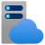
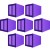

# Azure 900 - Chapter 2 - Services

## Azure Virtual Machine

### Key characteristics

- IaaS service
- Total control over the OS and the software
- Supports custom OS images
- Well suited for applications that require custom system configuration
- Lift-and-shit scenarios

### Pricing

- You pay for the VM as long as it is running
- You can stop the VM to stop the billing. ***Attention***
  - You can't use the VM while stopped
  - If you don't have a static IP address configured, your IP will likely change when the VM is started

### Downtime

VMs are susceptible to downtime due to three types of events: *planned maintenance*, *unplanned maintenance*, and *unexpected downtime*.

#### Planned maintenance

- Planned updates that Microsoft makes to the host computer
- OS updates
- Driver updates

#### Unplanned maintenance

- Monitoring services detect that your VM's host computer might fail soon
- That computer will be flagged for unplanned maintenance
- Azure will attempt to move your VM to a healthy host computer
- The move takes a short time, and the VM is in a paused state. If the operation fails, the VM will experience *unexpected downtime*

### Availability sets

*Availability sets* protect you from maintenance events and downtime caused by hardware failure. Azure does that by creating some underlying entities in an availability set called *update domains* and *fault domains*.

#### Fault domains

- Logical representation of the physical rack in which a host computer is installed
- By default, Azure assigns 2 fault domains to an ***availability set***
- If a problem occurs in one fault domain, the VMs in the other fault domain won't be affected
- Protects against: ***unplanned maintenance*** and ***unexpected downtime***

#### Update domains

- By default, Azure assigns 5 update domains to an ***availability set***. These are spread access the ***fault domains*** in the ***availability set***
- Azure reboots VMs in one update domain at a time, waiting 30 minutes for computers to recover before moving to the next update domain
- Protect against: ***planned maintenance***

#### Disadvantages

- Every VM in a ***availability set*** has to be explicitly created
- In cases in which your VM serves a web application, you will need to configure a *load balancer* to handle the the traffic and routing
- Redundancy costs more
- Not compatible with ***availability zones**

### Scale sets

- *Scale sets* are deployed in ***availability sets***
- You automatically benefit from ***fault domains*** and ***update domains**
- Compatible with ***availability zones***, so you are protected from problems in an Azure *datacenter*
- You can configure scaling rules based on metrics such as CPU, disk usage, network usage, and so forth
- Based on the **auto-scale providers**, *scale sets* allow you to automatically add or remove VMs based on the metrics mentioned above
- It helps reducing costs

### SLA

- Single-instance VM with premium storage: 99.9%
- Multi-VM deployment: 99.95%

## Virtual Network (VNet)

*Azure Virtual Network (VNet)* enables Azure resources (e.g., VMs) to securely communicate with each other, the internet, and on-premises networks.

### Key characteristics

- Enables secure communication between Azure resources, the Internet, and on-premises networks
- Allows network traffic filtering and routing
- You can break the VNet in multiple subnets and distribute the IP address space
- You can configure rules to control the connectivity between subnets

### Pricing

Free of cost.

### Public IP Address

*Azure Public IP address* enables inbound communication from the Internet to an Azure resource (e.g., a VM), and outbound connectivity to the Internet using a predictable IP address.

### Network security group

*Azure Network Security Groups* enables network traffic filtering by allowing the creation of multiple inbound and outbound security rules.

### VNet peering

Allows communication between Azure VNets. This enables resources in either VNet to communicate with each other.

#### Key characteristics

- VNet peering is of two types:
  - VNet peering: Connects VNets within the same Azure region
  - Global VNet peering: Connects VNets across Azure regions
- The traffic is not encrypted, however, it travels over Azure's private backbone infrastructure, and not over the Internet

## Azure VPN Gateway

### Key characteristics

- Azure VPN Gateway uses VPN connections to enable secure connectivity
- Allows encrypted communication between Azure VNets and on-premises networks over the *public Internet*
- Can also be used between Azure VNets as well, and the traffic goes the Microsoft network
- It uses Internet protocol security (IPSec) and the Internet key exchange (IKE) protocols

### Pricing

You pay for two things: the hourly compute costs for the virtual network gateway, and the egress data transfer from the virtual network gateway.

### Gateway types

#### VPN

Creating a *VPN* gateway resource can take up to 45 minute before it is ready for use. There are three connection types supported by a VPN gateway: *VNet-to-VNet*, *site-to-site*, and *point-to-site*.

##### VNet-to-VNet

The VNets you connect can be:

- in the same or different regions
- in the same or different subscriptions
- in the same or different deployment model (i.e., classic vs Resource Manager)

##### Site-to-site

This type of gateway connection enables a connection from a VNet to an on-premises network using encrypted VPN connection. It also requires a device located on-premises that has a public IP address assigned to it.

##### Point-to-site

A Point-to-Site (P2S) VPN gateway connection lets you create a secure connection to your VNet from an individual client device. This device can be a computer, a mobile device, a tablet or a smartphone.

#### ExpressRoute

##### Key characteristics

- Can offer up to 10 Gbps network speed over dedicated fiber-optic connections
- Connections are made from your on-premises network to a Microsoft Enterprise Edge (MSEE) router, which then, connects you to Azure
- The MSEE router sits on the edge of Microsoft's network
- The ExpressRoute data does not traverse the public Internet, thus bandwidth is much more reliable

##### Advantages over the VPN type

The VPN gateway type has some limitations, such as a maximum of 1.25 Gbps in network speed. Moreover, the traffic is sent over the public Internet.

## Disk Storage

*Azure Disk Storage* is used by Azure VMs to store OS and application data.

### Key characteristics

- The storage is available as both HDD or SSD storage
- HDds are cheaper and designed for noncritical data
- SSDs are designed for light use in *Standard tier*, and heavy use in *Premium tier*

#### Types of disks

##### Unmanaged

You can use ***Azure Storage Account*** to store the `.vhd` files in *page blobs*.

##### Managed

Azure creates a separate resource and handles everything behind the scenes: the storage account, storage limitations, and so on. All you need to worry about is your disk, Azure manages everything else.

## Storage Account

An *Azure storage account* contains all of your Azure Storage data objects, including blobs, file shares, queues, tables, and disks. The storage account provides a unique namespace for your Azure Storage data that's accessible from anywhere in the world over HTTP or HTTPS. Data in your storage account is durable and highly available, secure, and massively scalable.

### Blob storage

Binary Large Objects (BLOBs) referrers to data such as text files, images, videos, documents and many more. Azure Blob Storage is designed for storing unstructured data. An entity stored in Blob Storage is referred to as a blob. There are a couple types of blobs:

- **Block blob**: used to store files used by an application
- **Append blobs**: used to store files that are often updated, such as diagnostic logs
- **Page blobs**: used to store hard disk (.vhd) files

Blobs are organized in containers.

Uploading data from on-premises to Azure Blob Storage can be done via tools such as Azure Storage Explorer or Data Box for large amounts of data.

### Files storage

Azure Files storage is a managed file share that can be mounted, such as Server Message Block (SMB) file shares. Azure File shares can be mounted to Azure VMs and on-premises Windows, Linux, and MacOS. Because they use SMB, you will need the TCP port 445 to be open on your network.

### Storage Account tiers

#### Hot Access

This type of access is recommended for data that is accessed often. It has the highest cost of storage, but the lowest cost of access.

#### Cool Access

This type of access is recommended for data that is not accessed often but intended to be kept for a longer period. It has a low cost of storage, but the access cost is higher.

#### Archive

This type of access is recommended for long-term data storage. If you delete data sooner than 180 days that it got uploaded, you will be charged with a deletion fee. This type of data is not designed for quick and frequent access. The price of storage is the lowest, but the price of access is the highest. The Hot and Cool tiers guarantee access to the first byte of data within milliseconds, whereas with the archive tier that guarantee is within 15 hours.

## App Service Plan

### Key characteristics

- PaaS service
- A set of compute resources is created for the ASP
- When you create a ASP, you need to specify the following:
  - OS (Windows, Linux)
  - Region
  - Number of VM instances
  - Size of VM instances (Small, Medium, Large)
  - Pricing Tier

### Pricing

The pricing tier of an App Service plan determines what App Service features you get and how much you pay for the plan. The pricing tiers available to your App Service plan depend on the operating system selected at creation time. There are a few categories of pricing tiers:

- **Shared compute**: Free and Shared, the two base tiers, runs an app on the same Azure VM as other App Service apps, including apps of other customers. These tiers allocate CPU quotas to each app that runs on the shared resources, and the resources cannot scale out.

- **Dedicated compute**: The Basic, Standard, Premium, PremiumV2, and PremiumV3 tiers run apps on dedicated Azure VMs. Only apps in the same App Service plan share the same compute resources. The higher the tier, the more VM instances are available to you for scale-out.

- **Isolated**: This Isolated and IsolatedV2 tiers run dedicated Azure VMs on dedicated Azure Virtual Networks. It provides network isolation on top of compute isolation to your apps. It provides the maximum scale-out capabilities.

## App Service (Web Apps)

### Key characteristics

- PaaS service
- Allows you to run Web applications by using a preconfigured VM with a runtime stack (Java, .NET, Python, ...)
- Allows you to run Docker containers

### Pricing

You are charged for the ***App Service Plan*** on which the ***App Service*** is running.

## Azure Container Instances (ACI)

### Key characteristics

- Allows you to run Docker containers
- You have to specify:
  - The Docker image location
  - CPU and Memory
  - DNS label and port mapping
- **Attention**! you cannot change the DNS label or the Docker image after creation.

### Pricing

You are paying for the CPU and Memory your ***ACI*** is using.

## Azure Kubernetes Service (AKS)

### Key characteristics

- AKS is a container orchestration service
- Responsible for monitoring and ensuring that containers are always running
- Auto-scales based on the workload
- Creates containers in a pod
- A pod represents a group of related containers
- Containers cannot share resources if they are in different pods
- The computer that runs a pod is called a *worker* or a *node*
- A ***node*** has a container runtime such as Docker installed, alongside Kubernetes services
- The ***nodes*** are managed by *master* node
- The entire environment is called a Kubernetes cluster

### Pricing

You are only paying for the VMs, the associated storage, and networking resources consumed by the AKS.

## Azure Cosmos DB

Azure Cosmos DB is a multi-model globally distributed database service.

|      System      |      Description                                                                                                                                                                                                                       |      Common    Use                                                                                                                                                                                                                                                 |
|------------------|----------------------------------------------------------------------------------------------------------------------------------------------------------------------------------------------------------------------------------------|--------------------------------------------------------------------------------------------------------------------------------------------------------------------------------------------------------------------------------------------------------------------|
|     Key-value    |     Stores data that is tied to a   unique key. Pass in the key and the database returns the data.                                                                                                                                     |     Because the value can be just   about anything, key-value databases have many uses.                                                                                                                                                                            |
|     Column       |     NoSQL databases are called keyspaces,   and a keyspace contains column families. A column contains rows and columns   like a relational table, but each row can have its own set of columns. You   aren’t locked into a schema.    |     Storing user-profile data for a   website. Also, because column databases scale well and are extremely fast,   they are well-suited to storing large amounts of data.                                                                                          |
|     Document     |     Data is stored as a structured   string of text called a document. This can be HTML, JSON, and so forth. This   is similar to a key-value database, except that the document is a structured   value.                              |     Same as key-value, but document   databases have advantages. They scale well horizontally, and they allow you   to query against the value and return portions of the value. A key-value   database query returns the entire value associated with the key.    |
|     Graph        |     Stores data and the relationships   between each piece of data. Data is stored in nodes, and relationships are   drawn between nodes.                                                                                              |     Many systems use graph databases   because they are extremely fast. A social network might use a graph database   because it would be easy to store relationships between people, things those   people like, and so forth.                                    |

When you create a Cosmos DB database, you choose the API you want to use, which determines the database type for your database. The database API types are:

- **Core (SQL)** Creates a document database that you can query using SQL syntax that you might be familiar with from using relational databases.
- **Azure Cosmos DB for MongoDB API** Used for migrating a MongoDB database to Cosmos DB. MongoDB databases are document databases.
- **Cassandra** Used for migrating a Cassandra database to Cosmos DB. Cassandra databases are column databases.
- **Azure Table** Used for migrating data stored in Azure Table Storage to Cosmos DB. This creates a key-value database.
- **Gremlin** Used for migrating Gremlin databases to Cosmos DB. Gremlin databases are graph databases.

Microsoft calls these APIs because they are just that: APIs. They are application programming interfaces that allow developers who are already using an existing NoSQL database technology to migrate to Cosmos DB without having to change their code.

Another huge advantage to Cosmos DB is a feature known as turnkey global distribution. This feature takes advantage of the horizontal scalability of NoSQL databases and allows you to replicate your data globally with a few clicks.

## Azure SQL Database

Azure SQL Database is a PaaS offering for the SQL Server database. Azure offers three different deployment options for Azure SQL database:

### Single Database

A single database represents simply a database that is running on a sql server. Azure manages the database server, but the customer needs to manage the database. Azure provides two different purchase models for single databases: Database Transaction Unit (DTU) and virtual core (vCore).

DTU represents a collection of CPU, memory, and data reads and writes that come in three tiers: Basic, Standard, and Premium.

vCore represents a more granular configuration, being able to choose the exact hardware you need.

|      DTU    Model                                                                                                                   |      vCore    Model                                                                                                                                            |   |
|-------------------------------------------------------------------------------------------------------------------------------------|----------------------------------------------------------------------------------------------------------------------------------------------------------------|---|
|     Good choice for users who don’t   need a high degree of flexibility with configuration and who want fixed   pricing.            |     Good choice if you need a high   level of visibility and control of individual resources (such as memory,   storage, and CPU power) your database uses.    |   |
|     Pre-configured limits for   transactions against the database, and pre-configured storage, CPU, and   memory configurations.    |     Flexibility in CPU power, memory,   and storage, with storage charged on a usage basis.                                                                    |   |
|     Basic and Standard offerings,   along with a Premium tier for production databases with a large number of   transactions.       |     General Purpose and Business   Critical offerings to provide lower costs when desired and high-performance   and availability when required.               |   |
|     Ability to scale to a higher tier   when needed.                                                                                |     Ability and flexibility to scale   CPU, memory, and storage as needed.                                                                                     |   |
|     Backup storage and long-term   retention of data provided for an additional charge.                                             |     Backup storage and long-term   retention of data provided for an additional charge.                                                                        |   |

### Elastic pool

This model consists of more than one databases managed by the same SQL server. This offering is more geared towards SaaS applications, where each user could have its own database, and moving databases in and out of an elastic pool is easily done.

In this case, you are charged for the resources used by the entire pool, not by single databases.

### Managed instance

This model is designed for customers that want to migrated from on-premises or another non-azure environment to Azure.

Azure developed a tool called Azure Database Migration Service (DMS) to make it easier for customers to move on-premises databases to a managed instance.

## Azure Database for MySQL

Azure Database for MySQL is a relational open-source database system. Since it is based on the MySQL Community Edition, you can easily move on-premises MySQL databases to the Azure cloud.

It offers several pricing plans based on your needs:

- **Basic**: light usage
- **General-Purpose**: business use
- **Memory Optimized**: high-performance requirements

## Azure Database for PostgreSQL

Azure Database for PostgreSQL is a relational open-source database system. The pricing model is similar to Azure database for MySQL. The Azure cloud manages the server, database security, performance, and other administrative tasks.
