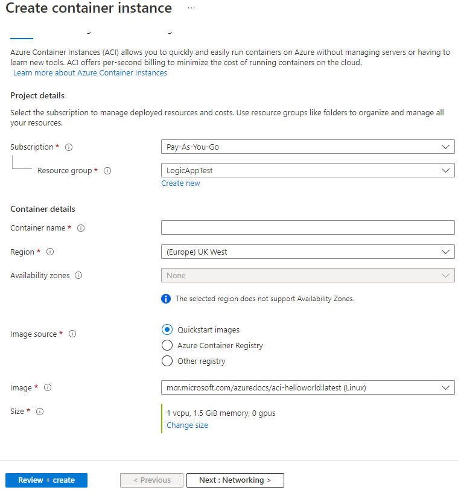

# Chapter 2

## Web App (App Service)

Web apps allow you to run applications by providing a preconfigured VM with a runtime stack (Java, .NET, PHP, etc.), or inside a Docker container.

Web apps are running on an App Service Plan VM, which can host multiple web apps.

Azure Web Apps are PaaS services and they provide a lot of configurations.

## Azure Container Instances (ACI)

Azure Container Instances (ACI) is a PaaS service which allows you to run containerized applications easily.

To run an application by using ACI, you have to specify the following settings:

- where the Docker image is located
- CPU and Memory
- a DNS label and configure the Ports mapping

**Tip** Changing the docker image or the DNS label is not possible after creation.

## Azure Kubernetes Service (AKS)

